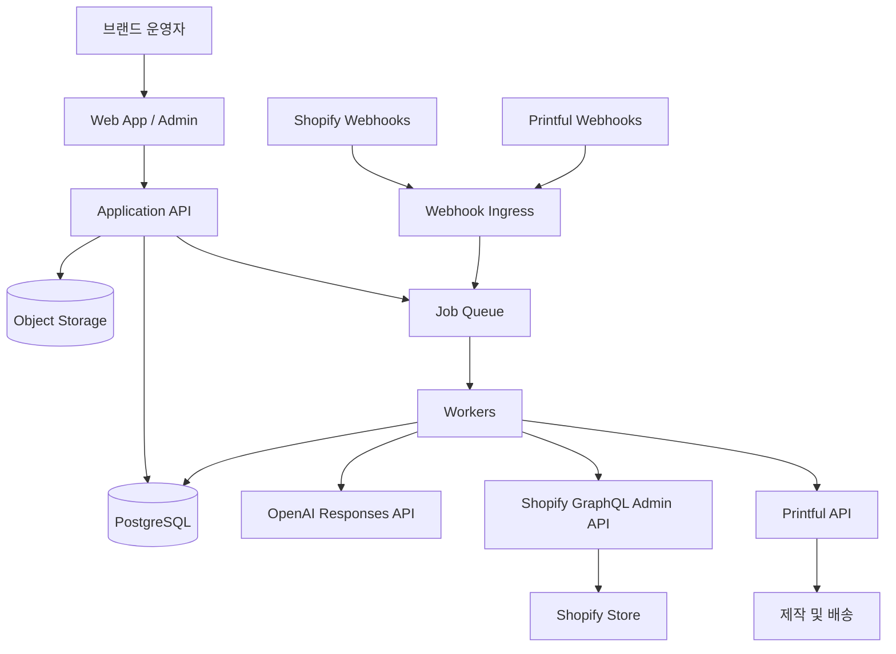

# 시스템 아키텍처

## 1. 설계 원칙

- **승인 우선**: 상품과 스토어 변경은 사용자의 승인 이후에만 외부에 쓴다.
- **AI와 업무 규칙 분리**: AI 출력은 제안 데이터이며 가격·마진·주문 판단의 권위 있는 값이 아니다.
- **비동기 경계 명확화**: AI 생성, 목업, 상품 동기화, 주문 전달은 작업 큐로 실행한다.
- **내부 DB가 워크플로 원장**: Shopify는 판매 채널, Printful은 공급·제작 원장으로 취급한다.
- **멱등성과 관찰 가능성**: 모든 외부 쓰기에 안정적인 키, 상태, 시도 횟수, 추적 ID를 남긴다.

## 2. 논리 구성

## 3. 컴포넌트 책임

| 컴포넌트 | 책임 | 금지 사항 |
|---|---|---|
| Web App | 온보딩, 편집, diff, 승인, 예외 처리 | 외부 비밀키 보관, 직접 외부 API 호출 |
| Application API | 인증, 권한, 입력 검증, 명령 생성 | 장시간 외부 작업 동기 실행 |
| Rules Engine | 점수, 가격, 마진, 주문 차단 사유 계산 | 자연어 추론 |
| AI Gateway | 프롬프트 버전, Structured Outputs, 비용/지연 기록 | AI 결과를 검증 없이 저장 |
| Shopify Adapter | OAuth 세션, GraphQL, Webhook, ID 매핑 | REST Admin API 신규 구현 |
| Printful Adapter | 카탈로그, 목업, 주문, 상태 동기화 | Shopify 모델을 Printful에 그대로 노출 |
| Worker | 재시도 가능한 비동기 작업 | 사용자 요청 컨텍스트에 의존 |
| Webhook Ingress | raw body 서명 검증, 중복 제거, 큐 적재 | 제작 주문 등 긴 작업 수행 |

## 4. 권장 배포 단위

MVP는 모듈러 모놀리스로 시작한다.

- `web`: 사용자 UI와 서버 라우트
- `worker`: 생성·동기화·주문 작업
- `postgres`: 영속 데이터 및 outbox
- `queue`: 관리형 큐 또는 Redis 기반 큐
- `object storage`: 디자인 원본과 파생 이미지

도메인 모듈은 `identity`, `brand`, `catalog`, `content`, `storefront`, `commerce`, `fulfillment`, `operations`로 나눈다. 초기부터 마이크로서비스로 분리하지 않지만 외부 어댑터와 도메인 코드는 인터페이스로 격리한다.

## 5. 주요 처리 흐름

### 콘텐츠 생성

`온보딩 제출 → 작업 생성 → AI 구조화 → JSON Schema 검증 → 도메인 검증 → draft 저장 → 사용자 승인`

스키마 실패는 동일 프롬프트의 무한 재시도가 아니라 제한된 자동 재시도 후 운영 오류로 전환한다.

### 상품 게시

`승인된 상품 revision → 디자인/가격 재검증 → Printful 목업 확보 → Shopify 동기화 → 외부 ID 저장 → 게시 결과 표시`

목록 필드를 갱신하는 `productSet`은 입력에서 누락한 기존 항목이 제거될 수 있으므로, STORZY가 관리하는 전체 목록을 읽고 의도한 최종 상태를 만들어 전송한다.

### 주문 처리

`Webhook 검증/저장 → 즉시 응답 → 큐 소비 → 최신 주문 조회 → 규칙 검증 → Printful draft 생성 → 재검증 → confirm → 상태 동기화`

Printful API가 draft/confirm 단계를 지원하는 경로를 사용해 외부 비용 확정 직전에 한 번 더 검증하는 것을 원칙으로 한다. 실제 v2 주문 계약은 구현 스파이크에서 확정한다.

## 6. 데이터 일관성

- 내부 DB 변경과 작업 발행은 transactional outbox로 묶는다.
- Webhook event ID 또는 공급사 event identity에 unique constraint를 둔다.
- 각 동기화 리소스는 `local_id`, `provider`, `provider_id`, `last_synced_revision`, `sync_status`를 가진다.
- 외부 데이터가 바뀌면 무조건 덮어쓰지 않고 소유권 매트릭스에 따라 충돌을 기록한다.
- 금액은 `{amount_minor, currency}`로 저장하고 환율 적용 결과와 원본 환율을 함께 보존한다.

## 7. 기술 선택 확정 전 조건

프레임워크, DB ORM, 큐 공급자, 호스팅은 아직 결정하지 않는다. 선택 시 다음을 만족해야 한다.

- Shopify 공식 앱 템플릿 및 OAuth 지원성
- raw request body 기반 Webhook 서명 검증
- PostgreSQL 트랜잭션과 background job 지원
- 타입에서 JSON Schema 또는 그 반대의 단일 소스 생성
- 로컬에서 Shopify/Printful fixture를 사용한 계약 테스트 가능

