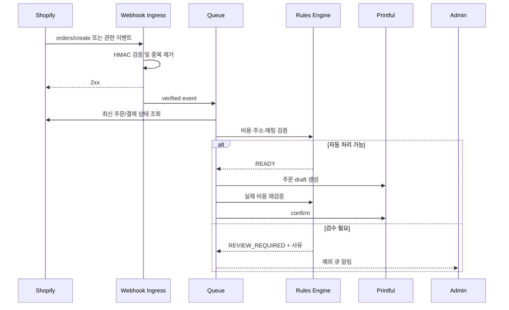

# 주문 자동화와 운영

## 1. 안전한 주문 흐름

## 2. 자동 처리 조건

다음 조건을 모두 만족해야 한다.

- Shopify에서 결제가 승인/완료된 주문이며 취소되지 않음
- 모든 대상 line item에 정확히 하나의 활성 ProductMapping 존재
- 배송 국가가 허용 목록에 있고 Printful 배송 가능
- 주소 필수 필드와 형식이 유효
- 디자인 원본과 각 placement 파일이 존재하고 검증됨
- 현재 공급 원가와 배송비를 반영해 판매 손실이 없음
- 공급 원가 상승률이 허용 임계값 이내
- 제품/변형이 주문 가능한 상태
- 주문 총액과 수량이 자동 승인 한도 이내
- 동일 fulfillment revision이 제출되지 않음

## 3. 기본 차단 규칙

| 코드 | 조건 | 기본 조치 |
|---|---|---|
| `NEGATIVE_MARGIN` | 판매 수입보다 보수적 변동비가 큼 | 차단 |
| `UNSUPPORTED_COUNTRY` | 제작/배송 불가 국가 | 차단 |
| `INVALID_ADDRESS` | 주소 누락/검증 실패 | 검수 |
| `VARIANT_UNAVAILABLE` | 품절 또는 비활성 | 검수 |
| `COST_SPIKE` | 승인 원가 대비 임계값 이상 상승 | 검수 |
| `HIGH_VALUE_ORDER` | 금액/수량 한도 초과 | 검수 |
| `MISSING_DESIGN` | 파일 또는 placement 누락 | 차단 |
| `MAPPING_AMBIGUOUS` | 외부 변형 매핑 0개 또는 복수 | 차단 |
| `PAYMENT_NOT_READY` | 결제 상태 미충족 | 대기 |
| `DUPLICATE_SUBMISSION` | 동일 주문 revision 제출 이력 | 성공으로 간주/조회 |

임계값은 workspace policy로 관리하되, 기본값은 실제 통화와 주문 샘플을 본 뒤 확정한다.

## 4. 예외 큐 화면 요구사항

- 주문번호, 고객 식별 최소 정보, 생성 시각
- 차단 코드와 사람이 이해할 수 있는 근거
- 승인 당시 비용과 현재 견적 비교
- 영향을 받는 line item, variant, design 미리보기
- `재검증`, `수동 승인`, `거절`, `연결 수정` 액션
- 수동 승인 시 사유 필수 입력 및 actor/time 감사 기록
- 이미 제작 중인 주문에는 가능한 액션만 노출

## 5. 재시도와 복구

- 네트워크, 429, 일시적 5xx만 지수 backoff와 jitter로 자동 재시도한다.
- validation 4xx는 자동 재시도하지 않고 검수 큐로 보낸다.
- timeout은 성공 여부 불명 상태이므로 외부 ID로 조회 후 재시도한다.
- 최대 시도 후 dead-letter 상태로 이동하고 알림을 보낸다.
- Webhook 누락 복구를 위해 최근 주문/fulfillment를 기간 기준으로 재조정하는 reconciliation job을 둔다.
- 동일 이벤트 재생 기능은 원본 payload, handler version, dry-run을 지원해야 한다.

## 6. 배송 반영

- Printful shipment 단위를 Shopify fulfillment와 매핑한다.
- 부분 배송과 여러 송장번호를 지원한다.
- tracking number만으로 배송 완료를 추정하지 않는다.
- Shopify 반영 실패가 Printful 배송 상태를 되돌리지는 않으며 재조정 작업으로 복구한다.
- 고객 알림 전송 여부는 Shopify fulfillment mutation의 옵션과 스토어 정책으로 명시한다.

## 7. 운영 지표

- Webhook 검증 실패율, 중복률, 처리 지연
- 자동 처리/검수/차단 주문 비율과 사유별 건수
- Printful 제출 성공률, timeout unknown 건수, 중복 방지 건수
- 비용 상승과 음수 마진 차단 금액
- 주문 상태 불일치 수와 reconciliation 복구 시간
- 예외 큐 체류 시간과 수동 승인 결과

